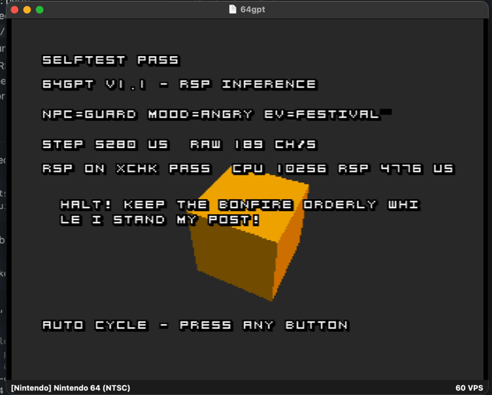

# 64GPT — a tiny neural NPC dialogue brain running on a real Nintendo 64

A character-level GRU (~100K parameters, int8-quantized) that generates
short NPC dialogue **on real N64 hardware**, built with the
[Pyrite64](https://github.com/HailToDodongo/pyrite64) engine on
[libdragon](https://libdragon.dev). The demo is a dialogue box that
streams AI-generated text; controller buttons cycle the conditioning
(`NPC=guard / Mood=angry / Event=stole_sword`), A regenerates.



## Method: the walking skeleton

The AI is never built in isolation and "ported at the end". A bootable
ROM ships at **every** milestone — starting with a fake model that says
one canned line — and each milestone swaps in the smallest real piece.
The on-console proof is re-verified continuously:

- Inference is pure integer math and the model blob is parsed
  byte-by-byte, so output is **bit-exact identical** on the Mac, in the
  Ares emulator, and on the console.
- Every ROM boots with a **self-test** that replays committed golden
  vectors and prints `SELFTEST PASS/FAIL` on screen.
- Per-milestone gate: host tests green + Ares boot with SELFTEST PASS.
  Real-hardware (EverDrive-64) runs are occasional spot-checks, and
  required for v1.0.

## Status

- [x] **M0** — repo skeleton, docs, verification loop: toolchain +
      Ares installed, stock example built headlessly and boots in Ares
      (`docs/milestones/m0.md`)
- [x] **M1** — ROM v0.1, the walking skeleton: canned-line "model" behind
      the final streaming API; parser + generation tests green; boots in
      Ares with SELFTEST PASS + streaming dialogue box
      (`docs/milestones/m1.md`)
- [x] **M2** — ROM v0.2: real GRU overfit on ONE line — first neural net
      on N64: int8 weights, integer-only inference, bit-identical to the
      Python trainer (`docs/milestones/m2.md`)
- [x] **M3** — ROM v0.3: conditioning on a dozen hand-written lines —
      prompt priming (`NPC=… MOOD=… EV=…|`) selects which line the GRU
      speaks; 12/12 bit-exact on host and in the ROM self-test
      (`docs/milestones/m3.md`)
- [x] **M4** — ROM v0.9: full generated corpus + temperature/top-k
      sampling — 1.5MB generated corpus, H=128 (~68K params) trained
      with a val split; seeded xorshift32 sampler bit-exact from trainer
      to silicon; every regenerate speaks a fresh in-character line
      (`docs/milestones/m4.md`)
- [x] **M5** — ROM v1.0-rc: performance pass — 16.6ms → 9.8ms per char
      (`-O3` core + int32 accumulators, bit-exactness preserved); raw
      102 chars/sec, sustained 60 at a held 60 VPS — 2× the ≥30 gate
      (`docs/milestones/m5.md`, `docs/07-performance.md`)
- [ ] **M6** — ROM v1.0: running on a real N64 via EverDrive
- [x] **M6.1** — ROM v1.1: RSP-powered inference — the hot matvec runs
      on the graphics coprocessor, bit-exact (boot self-test + on-screen
      CPU-vs-RSP cross-check), 10.3ms → 4.8ms per char with the CPU
      freed; engine cap raised to H=256 for the M7-scale model
      (`docs/milestones/m6.1.md`)
- [x] **M7** — ROM v1.2: first living NPC, Selena — Event Bus + Shared
      World State + NPC Database + Context Builder replace hardcoded demo
      conditioning; H=256 (~266K params) trained on a schema-conditioned,
      120-combo corpus with prefix-loss masking and a combo-level holdout
      split; identity-conditioning proven at scale (per-axis divergence
      table, identity 0.94 ≥ mood 0.92); int8-vs-float agreement 99.25%;
      SELFTEST PASS in Ares (`docs/milestones/m7.md`)
- [x] **M8** — ROM v1.3: archetypes, the portability substrate — manifest
      meta-schema (`docs/08-manifest-schema.md`) separates mechanism from
      per-game content; archetype/instance system (personality-range +
      deterministic xorshift32 jitter) proven on `guard`, 4 seeded
      instances sharing Selena's model; within-archetype divergence 0.94
      vs. mood baseline 0.97; SELFTEST PASS in Ares, START cycles NPC
      live in the demo (`docs/milestones/m8.md`)
- [x] **M9** — ROM v1.4: compositional conditioning — M8's opaque
      `N:<id>` identity tag replaced with reusable descriptive features
      (`P:<person> D:<descriptor> OCC:<occupation> R:<tier> M:<mood>
      C:<context> EV:<event>|`); RSP matvec kernel generalized to H=320
      (~394K params, first non-power-of-2 hidden size, 320B DMEM
      headroom); curated 3-character cast (Bram/Fergus/Kragan) trained
      via template-grammar corpus generation after a freeform-LLM-corpus
      attempt measurably garbled at this model's scale; val loss 0.0985
      (beats M8's 0.1026 despite +50% params), int8-vs-float agreement
      0.9838; SELFTEST PASS + XCHK PASS together on the real trained
      model for the first time; all three new characters confirmed live
      via START cycling on real hardware. **Known open gap**: generated
      text coherence remains inconsistent, confirmed live on real
      hardware — not silently claimed solved (`docs/milestones/m9.md`,
      `docs/plan.md` Known follow-ups). **M9.2** (`docs/milestones/
      m9.2.md`): evaluated four ideas from an external N64 project
      (Legend of Elya) — RSP tiling and float math primitives rejected
      on the merits (redundant/less-precise, and violates this project's
      hard no-floats constraint respectively), a narrow Kragan
      catchphrase bank adopted and A/B tested. Production retrain + ROM
      build + Ares boot: SELFTEST PASS, RSP ON, XCHK PASS, but the
      coherence gap persists on real hardware at full production scale —
      the mitigation didn't close it, recorded honestly rather than
      oversold
- [x] **M10** — ROM v1.5: procedural cast — a recurring villain
      (Shadewrath, `full` tier), a mid-tier talking boss (Korrath) bound
      into his service, 4 new town archetypes, and
      `DungeonGenerator::npcsForLevel()` deriving thin-tier NPC placement
      deterministically from a level seed (30 host-test checks,
      including a test that reloading a level reproduces identical
      dialogue *text*, not just seed equality). A real EEPROM save
      system (`game/src/user/SaveData.h`/`.cpp`, libdragon's `eepfs`)
      persists the villain's/boss's highest trust tier across a genuine
      Ares restart — verified live, not just compiled. Wired into the
      live demo: `R` generates a new dungeon level, `START` cycles its
      NPCs, `Z` returns to the fixed roster; verified on real hardware
      with the bad guy's persisted trust tier carrying into a
      freshly-generated encounter. SELFTEST + XCHK PASS for 27 goldens,
      RSP ON. **Known open gap, carried forward honestly**:
      Shadewrath's/Korrath's generated-text coherence remains
      inconsistent even after a density-raising retrain, which surfaced
      a new cross-trust-tier content-bleed failure mode rather than
      resolving the original one (`docs/milestones/m10.md`,
      `docs/plan.md` Known follow-ups)
- [x] **M11** — ROM v1.6: town cast + Elowen — the gossip mechanism
      (a player-caused event reaches nearby town NPCs' conditioning
      secondhand, verified: a hand-authored gossip line reproduced
      verbatim mid-generation), 2 more town archetypes (merchant/
      healer), and Elowen, a rescued elf princess found in the dungeon
      (mid tier, dungeon-only, her own persisted trust tier doubling as
      the in-game rescue event). SELFTEST + XCHK PASS for 36 goldens,
      RSP ON. **Honest negative result, shipped anyway**: this
      milestone's quality push (a shared lore bank meant to fix
      Shadewrath's/Korrath's standing coherence gap) was combined with
      the new content into one retrain — agreement dropped
      0.9771→0.9536 and garbling spread beyond Shadewrath/Korrath to
      previously-clean characters including Selena, evidence the
      combined-retrain approach (not the lore-bank idea itself) was the
      mistake. Recorded plainly rather than reworked until it looked
      like a win (`docs/milestones/m11.md` has the full record and a
      retrospective correction to this project's own prior "one
      retrain covers all of it" advice). M11.1 retries with proper
      single-variable isolation

## Quickstart

Host tests (any OS, needs cmake + a C++20 compiler):

```sh
cmake -B build tests && cmake --build build
ctest --test-dir build --output-on-failure
```

Regenerate the model blob + golden vectors (stdlib-only Python 3):

```sh
python3 trainer/make_canned_blob.py
```

Build the ROM (macOS, after the one-time toolchain install —
`docs/01-toolchain-and-pyrite64.md`):

```sh
# ./pyrite64 is a local wrapper that execs the app binary by its REAL path —
# running it via a plain symlink breaks the app's resource lookup and the
# build fails with an empty Makefile (docs/01-toolchain-and-pyrite64.md).
./pyrite64 --cli --cmd build "$PWD/game/project.p64proj"   # → game/64gpt.z64
ares game/64gpt.z64
```

## Repo map

| dir | contents |
|---|---|
| `core/` | the inference engine — portable C-style C++, zero libdragon deps, compiled unchanged into host tests and the ROM |
| `tests/` | host test suite (CMake/CTest, ASan/UBSan); `tests/vectors/` holds committed goldens |
| `trainer/` | Python tooling: blob export now; corpus/train/quantize/ref-impl from M2 |
| `game/` | the Pyrite64 project (see `game/README.md`) |
| `docs/` | concept guides + per-milestone notes |
| `versions/` | built `.z64` ROMs, one per milestone (EverDrive-ready; see its README) |

## Docs

Written for a good software engineer who has never done game dev or
embedded ML — start at 00 and read in order, or jump in:

- [00 — N64 primer](docs/00-n64-primer.md)
- [01 — Toolchain & Pyrite64](docs/01-toolchain-and-pyrite64.md)
- [02 — Pyrite64 scripting: DialogueDemo explained](docs/02-pyrite64-scripting.md)
- [03 — The NGPT model blob format](docs/03-blob-format.md)
- [04 — Fixed-point inference](docs/04-fixed-point-inference.md)
- [05 — A GRU on a napkin](docs/05-gru-on-a-napkin.md)
- [06 — The training pipeline](docs/06-training-pipeline.md)
- [07 — Performance](docs/07-performance.md)
- [ADR 0001 — Isolate decision logic into portable C++, host-test it](docs/adr/0001-host-test-portable-cpp-separate-from-libdragon.md)
- [ADR 0002 — No Debug/Release build type; a source switch gates the boot self-test instead](docs/adr/0002-no-debug-release-build-type-source-level-switch-instead.md)
- Milestone notes: [m0](docs/milestones/m0.md) · [m1](docs/milestones/m1.md) · [m2](docs/milestones/m2.md) · [m3](docs/milestones/m3.md) · [m4](docs/milestones/m4.md) · [m5](docs/milestones/m5.md) · [m6](docs/milestones/m6.md) · [m6.1](docs/milestones/m6.1.md)

## Pinned versions

| what | version | why |
|---|---|---|
| [pyrite64-mac](https://github.com/proverbiallemon/pyrite64-mac) | **v0.4.0** (release-asset app at `~/GitHub/Pyrite64-v0.4.0`, source clone at `~/GitHub/pyrite64-mac`) | early-dev engine, breaking changes; upgrade deliberately |
| MIPS toolchain | GCC 14.4.0 in `~/pyrite64-sdk` | installed by the Toolchain Manager |
| Ares emulator | v147+ | hardware-accurate; installed by the Toolchain Manager |
| Python | 3.12 via `uv python pin 3.12` (from M2) | PyTorch wheel availability |
