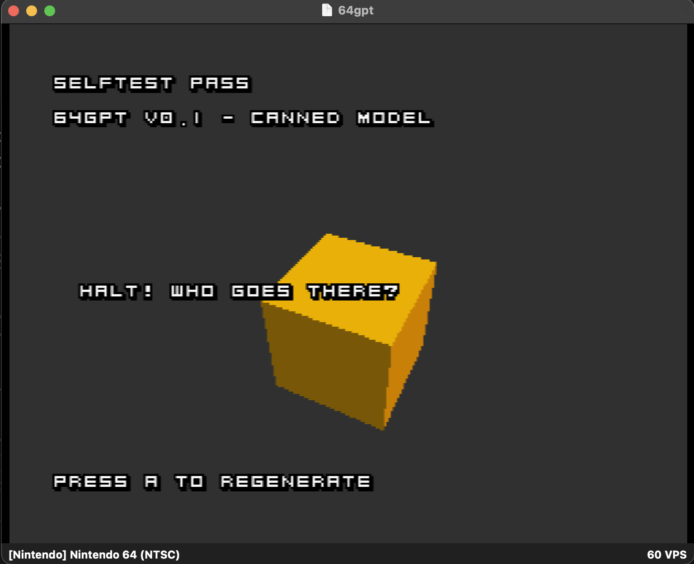

# M1 — Walking skeleton: an "AI" that says one canned line

**Status: done (2026-07-15) — host tests green, ROM v0.1 boots in Ares
with SELFTEST PASS. Tagged `m1`.**

## What was built

- `core/ngpt.{h,cpp}` — the `NGPT` blob parser and the **streaming API
  that never changes again**: `ngpt_load → ngpt_reset → ngpt_step → EOS`.
  The M1 "model" replays a canned line; M2 swaps a GRU in behind the
  same four calls.
- `tests/` — host test suite (CMake + CTest, ASan/UBSan, `-Werror`):
  - `test_blob_parser`: big-endian readers, valid parse, and the full
    rejection matrix (bad magic, truncation, version, model type,
    length overflow) on hand-crafted byte arrays.
  - `test_canned_model`: generation is byte-identical to the committed
    golden; EOS is sticky; reset regenerates identically; chunked
    per-frame stepping equals continuous stepping.
- `trainer/make_canned_blob.py` — emits the blob + golden vectors +
  ROM self-test header in one run, so they can't drift apart.
- `game/` — `DialogueDemo.cpp` (self-test + streaming dialogue box +
  A-to-regenerate), `src/user/n64gpt → core` symlink, `Makefile.custom`
  that packs `rawfs/model.bin` into the ROM filesystem.

## What it proves

- The engine core is memory-safe (sanitizers) and deterministic.
- The full data path — trainer emits blob → loader parses → stream →
  bytes match goldens — works end to end on the host.
- On Ares it additionally proved: CLI build, symlinked core compiling
  into the ROM, DFS asset loading, text rendering, input, and the
  self-test harness. "Same response every time" is the point of M1.

## Red → green trail

1. Parser tests written first → **red** (nothing compiled).
2. `ngpt.{h,cpp}` implemented → parser **green**; golden test **red**
   (vectors didn't exist yet).
3. `make_canned_blob.py` emitted vectors → all **green**, regeneration
   verified byte-identical (`md5sum` before/after).
4. Bonus check: `core/ngpt.cpp` compiled through the symlink path with
   ROM-like flags (`-std=gnu++20 -fno-exceptions -Wall -Wextra -Werror`).

## Gotchas hit

- The engine's builtin debug font is uppercase-only with 8×8 glyphs, so
  the canned line is uppercase and text wrapping is done by hand in the
  script. Good enough for the skeleton; a font64-based dialogue box
  (jam25-style) is the later upgrade.
- `Makefile.custom` is included *before* `assets_conv` is assigned in
  the generated Makefile, so `assets_conv +=` silently wouldn't work —
  adding a prerequisite to the `.dfs` target does.

## Gotchas hit on the Mac / Ares leg

- **The pyrite64 CLI must be exec'd by its real bundle path, never via a
  symlink.** Through a symlink, the app can't locate its `Resources/`
  templates, its file loader silently returns `""` for missing files, and
  the generated `game/Makefile` (plus all of `game/src/p64/`) comes out
  **0 bytes** → `make: *** No targets. Stop.` Our `./pyrite64` shim is
  now a wrapper *script* that `exec`s the real path. Full explanation:
  `docs/01-toolchain-and-pyrite64.md` § Building (this also corrects
  M0's "run from the clone root" rule — CWD never mattered).
- **No console output on the ROM = debug by drawing.** While bringing up
  DFS loading we drew a temporary `DBG RC/SIZE` line on screen with the
  load return code and blob size (rc 99 = init never ran, 100 = asset
  missing). Removed once the pipeline was proven; the SELFTEST banner is
  the permanent health check.
- **Scripts have exactly five hook names in the fork** —
  `initDelete/update/draw/onEvent/onCollision`; anything else (like the
  `init`/`destroy` upstream docs describe) compiles and is silently never
  called. Cost us the first SELFTEST FAIL: the model simply never loaded.
  Details: `docs/02-pyrite64-scripting.md`.
- **The editor does not expand `~` in the new-project path.** Typing
  `~/GitHub/64gpt/game` created the project *inside the app bundle*
  (`Pyrite64.app/Contents/Resources/~/GitHub/...`). Use an absolute path.
- **The editor nests new projects in a `<name>/` subdirectory** — it
  created `game/64gpt/`, which we flattened into `game/` so the committed
  `Makefile.custom` and `src/user/` sit where the build expects them.
- **Object files escape the build dir.** The generated Makefile compiles
  the symlinked core as `src/user/../../../core/ngpt.cpp`, so its
  `.o`/`.d` land in `game/core/` (the `../..` walks out of `build/`).
  Harmless, but git-ignored explicitly.

## Completed M1 steps (on the Mac, after M0)

- [x] One-time: Pyrite64 project created in `game/`, `DialogueDemo`
      attached to an object (exact steps: `game/README.md`).
- [x] Headless build → `game/64gpt.z64` (416 KB text + model in DFS).
- [x] Boot in Ares: **SELFTEST PASS**, line streams in, A regenerates.
- [x] Screenshot above, README checkbox, tag `m1`.
