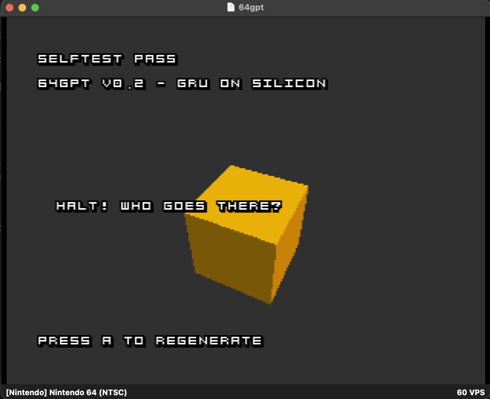

# M2 — Real GRU, one line of training data (ROM v0.2)

**Status: done (2026-07-15) — 26 Python + 3 C tests green, ROM v0.2 boots
in Ares with SELFTEST PASS running the int8 GRU. Tagged `m2`.** First
neural net on the N64. The entire ML pipeline landed; verification stays
trivial because a GRU overfit on ONE line must reproduce it byte-for-byte
with greedy decoding. This doc doubles as the spec — every test was
written against it.

## Gotchas hit

- **The GRU crashed the engine before it ever mispredicted.** First boot
  died with `std::bad_function_call` inside Pyrite64's VI swapchain. The
  actual culprit: ~6.5 KB of int64 accumulator scratch on the stack of
  `ngpt_gru_step` — Pyrite64 runs object-script callbacks on a small
  stack, and the overflow corrupted engine state that only exploded at
  the next frame swap. Scratch buffers are now `static` (engine is
  single-threaded; core stays heap-free). Host tests can't catch this
  class of bug — desktop stacks are megabytes.
- **A SELFTEST FAIL heisenbug in between.** After the static fix, one
  build showed FAIL with zero text, then an unrelated rebuild passed.
  Suspected stale incremental object for the symlinked core in the
  generated Makefile's dependency tracking. Rule adopted: **verify
  milestone gates on a clean ROM build** (`rm -rf game/build` first).
- Debug-by-drawing (M1's trick) again earned its keep: an on-screen
  line with load rc, parsed dims, and the first three step returns
  pinpointed "parse fine, generation fine" in one build.

## Architecture (fixed for M2, scales through M4)

Char-level GRU, **no embedding layer**: the input is a one-hot vector
over the vocab, so the input-weight "matvec" `W_i? · x` is just *column
`x` of `W_i?`* — a table lookup, free on the N64. Only the hidden-side
matvecs (`W_h? · h`) cost real work.

- Vocab: id 0 reserved for EOS; ids 1..V-1 are the sorted unique corpus
  chars (printable ASCII only — the debug font is uppercase 32..126).
- Cell (PyTorch `nn.GRU` convention, gate order r, z, n):
  - `r = σ(W_ir·x + b_ir + W_hr·h + b_hr)`
  - `z = σ(W_iz·x + b_iz + W_hz·h + b_hz)`
  - `n = tanh(W_in·x + b_in + r ⊙ (W_hn·h + b_hn))`
  - `h' = (1−z) ⊙ n + z ⊙ h`
- Head: `logits = W_out·h + b_out`, greedy argmax (ties → lowest id, so
  argmax is deterministic), generation starts from h = 0 and the EOS
  token as the first input, stops on EOS or a hard cap.
- M2 dims: `H = 32` (overfits one line in seconds); format carries H and
  V so M4 can ship `H ≈ 128, V ≈ 70` (~100K params) unchanged.

## Fixed-point scheme (the bit-exactness contract)

The reference is `trainer/ref_impl.py` (integer NumPy); `core/` must
match it bit-for-bit, and it must reproduce the training line exactly.

- Weights: **int8**, symmetric, power-of-two scale (stored as a shift
  amount `k`: `W_q = round(W·2^k)`, `|W_q| ≤ 127`) — shifts, not
  multiplies, on the N64. `W_ih` and `W_hh` **share one `k`** so the two
  gate accumulators land in the same scale and can be added directly;
  `W_out` gets its own `k_out` (argmax only cares about order).
- Hidden state and gate outputs: **int16 Q14** (1.0 = 16384; σ/tanh land
  in [-1, 1], so Q14 covers them with headroom for `h`).
- Accumulation: **int32** (int8 weight × int16 activation, summed over
  ≤ H+V terms — no overflow at these dims).
- Biases: **int32**, pre-scaled by the trainer into the accumulator's
  Q-domain (the C side never scales a bias).
- Rescale accumulator → LUT input: arithmetic right shift with
  round-half-up bias: `(acc + (1 << (s−1))) >> s`. C++20 defines `>>` on
  negative signed as arithmetic, and NumPy matches — same bits both sides.
- σ and tanh: **256-entry int16 LUTs emitted by the trainer**. Input is
  int16 **Q11** clamped to [−8·2048, 8·2048); `index = (x + 16384) >> 7`
  (bin width 2^7 = 1/16); `lut[i] = round(f((i−128)/16) · 16384)` (Q14
  out, bin left edge). Pre-activations rescale from the accumulator's
  `2^(k+14)` to Q11 by the rounding shift `k+3`. No interpolation —
  bit-exactness beats smoothness at these sizes.
- Elementwise products (`r⊙…`, `z⊙h`): `int16 × int16 → int32`, then the
  same rounding shift back to Q14, saturated to int16.
- **No floats anywhere in `core/`** — floats exist only in training;
  quantization is the trainer's job, replay is the console's.

## Blob payload, model type 1 (final layout)

Same 12-byte `NGPT` header (`docs/03-blob-format.md`), model type 1.
Payload, in order, all big-endian, parsed byte-by-byte:

| field | size | notes |
|---|---|---|
| H | u16 | hidden size |
| V | u16 | vocab size incl. the EOS slot |
| k_w | u8 | shared weight shift (W_ih, W_hh) |
| k_out | u8 | head weight shift |
| charset | V × u8 | byte 0 = 0x00 (EOS slot), then chars in id order |
| lut_sigmoid | 256 × i16 | Q14 out, [−8,8) Q11 in |
| lut_tanh | 256 × i16 | same indexing |
| W_ih | 3H·V × i8 | row-major, gate order r,z,n |
| W_hh | 3H·H × i8 | row-major |
| b_ih | 3H × i32 | scale 2^(k_w+14) |
| b_hh | 3H × i32 | scale 2^(k_w+14) |
| W_out | V·H × i8 | row-major |
| b_out | V × i32 | scale 2^(k_out+14) |

The trace goldens for the C tests ship separately in
`tests/vectors/m2_trace.bin`: u32 step count, then per step u16 input id,
u16 argmax id, H × i16 hidden state (all BE).

## TDD plan

Python first (`trainer/`, uv + Python 3.12 + PyTorch + pytest):

1. vocab round-trip (id 0 = EOS, sorted charset, encode/decode/bytes)
2. float overfit: one line → ~zero loss → greedy reproduces it exactly
3. quantizer: int8 round-trip error bounds; LUT max error vs float σ/tanh
4. `ref_impl.py`: integer NumPy generation == training line, byte-for-byte;
   per-step hidden states + logits committed as goldens
5. blob v1 export → re-import round-trip; goldens for the C side

Then C (`core/`), red→green in this order: saturating fixed-point ops →
LUT σ/tanh vs trainer tables → int8 matvec vs goldens → GRU cell single
step bit-exact → full greedy generation byte-identical → wired behind the
frozen `ngpt_*` API as model type 1.

Then ROM: same `DialogueDemo`, new blob; self-test replays the GRU
goldens. **Recommended EverDrive spot-check** — the neural-net-on-silicon
moment.

## Completed

- [x] Python tests 1–5 green (26 pytest)
- [x] C legs green (host, 3 suites incl. per-step bit-exact trace)
- [x] ROM boots in Ares with SELFTEST PASS on the GRU blob (clean build)
- [x] Docs: `04-fixed-point-inference.md`, `05-gru-on-a-napkin.md`,
      `06-training-pipeline.md`; this doc finalized
- [x] README checklist, commit, tag `m2`
- [ ] **EverDrive spot-check on the real console — recommended for this
      milestone (the "neural net on silicon" moment); Luke's call.**
